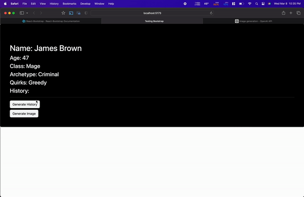

# NPC-GEN
Uses Open AI chat-gpt to generate a random NPC for you.

## to-do:
- [ ] add more customizable options (age, added history (for AI to learn from)
  - [x] Custom Name
  - [x] Custom History
  - [ ] Custom Race
  - [ ] Custom Class
- [ ] Users to input their own API key
- [ ] Customizable output (json, txt, etc)
- [ ] Custom variables for AI response (ie. Max_Tokens, Temperature, etc)
- [ ] Eliminate duplicate quirks