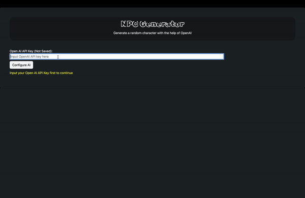

# NPC-GEN

Uses Open AI chat-gpt to generate a random NPC for you.

## Overview

## What I've Learned

### React and Component-Based Architecture

- **Component Creation**: Learned how to create reusable components like [`Header`](src/assets/Components/Header.jsx), [`Card`](src/assets/Components/Card.jsx), and [`GenerateButtons`](src/assets/Components/GenerateButtons.jsx).
- **State Management**: Utilized React's `useState` and `useEffect` hooks to manage component state and side effects.
- **Class Components**: Gained experience with class components, as seen in the [`ProfileCard`](src/App.jsx) component, and managing state within them.

### Animation with React Spring

- **useSpring Hook**: Implemented animations using the `useSpring` hook from `@react-spring/web` to create smooth transitions and effects in the [`Header`](src/assets/Components/Header.jsx) component.

### Routing with React Router

- **HashRouter**: Set up client-side routing using `HashRouter` from `react-router-dom` in the main entry point [`main.jsx`](src/main.jsx).

### API Integration

- **OpenAI API**: Integrated the OpenAI API to generate content dynamically, as demonstrated in the `generateHistory` and `generateImage` methods of the [`ProfileCard`](src/App.jsx) component.
- **Handling Promises**: Managed asynchronous operations and promises effectively to handle API responses.

### Styling and UI/UX

- **CSS and Bootstrap**: Applied custom CSS and Bootstrap for styling components, ensuring a responsive and visually appealing UI.
- **Animations and Loading Indicators**: Added animations and loading indicators to enhance user experience, such as the loading slime in the `generateHistory` method.

### PDF Generation

- **jsPDF**: Used the `jsPDF` library to export character profiles to PDF format, as seen in the `exportToPDF` method of the [`ProfileCard`](src/App.jsx) component.

### Project Configuration and Deployment

- **Vite**: Configured the project using Vite for fast development and build processes.
- **GitHub Pages Deployment**: Automated deployment to GitHub Pages using scripts defined in the [`package.json`](package.json).

### Code Organization and Best Practices

- **Modular Code Structure**: Organized code into meaningful directories and files, separating components, assets, and configuration files.
- **Documentation**: Maintained a clear and updated README to document project features and progress.

## Adding Custom Parameters

### To-Do:

- [ ] Use Environment Variables in gh pages for default AI key 
- [x] Add absolute help slider to header '?' box

- [ ] Add more customizable options (age, added history (for AI to learn from))
  - [x] Custom Name
  - [x] Custom History
  - [x] Custom Race
  - [x] Custom Class
  - [x] Add button to hide / show custom fields

- [x] Users to input their own API key

- [ ] Customizable output (json, txt, etc)
  - [x] PDF
  - [ ] Word
  - [ ] Excel

- [ ] Custom variables for AI response (ie. Max_Tokens, Temperature, etc)
- [ ] Eliminate duplicate quirks

- [ ] Clean up UI
  - [x] Circle image border
  - [x] Add more styling
  - [x] Mobile friendly

- [ ] Clean up UX
  - [x] Loading icons when generating 
  - [ ] Fix Slime Loading positions
  - [x] Animations

- [x] Update README gif to latest build